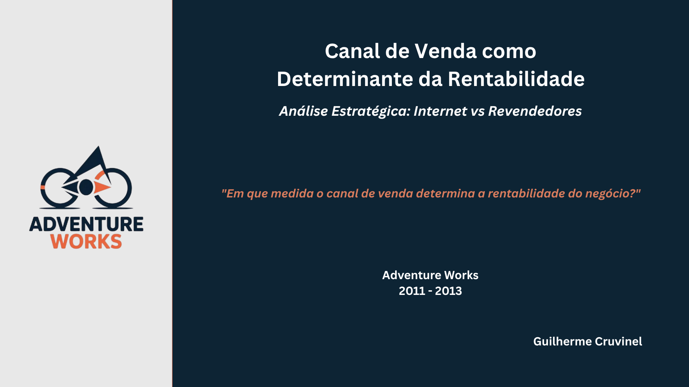

## Olá, eu sou o Guilherme 👋

### Analista de Dados | Raciocínio analítico aplicado a negócios

---

**Sobre mim:**

- 📊 Desenvolvendo projetos de análise com Power BI, SQL e Python
- 📍 Resido em Brasília — aberto a oportunidades remotas e presenciais em Brasília e Palmas-TO
- 🎯 Buscando oportunidade como Analista de Dados Júnior

---

**Principais ferramentas:**

  
  
  

  

**Onde me encontrar:**

---

## Portfólio e Principais Projetos

### Análise de Sustentabilidade — Contoso (Power BI)

A receita da Contoso caía de forma consistente entre 2007 e 2009, mas a margem percentual permanecia intacta. O problema não estava na operação, estava na composição do portfólio.

A investigação identificou um cluster de subcategorias com alta exposição à substituição tecnológica como principal driver da contração. Esse cluster, nomeado como "Tecnologias Dedicadas", foi responsável sozinho por -1,0 Bi de receita no período, enquanto o restante do portfólio cresceu +0,2 Bi.

O relatório está estruturado em duas páginas: a primeira apresenta a visão executiva da contração; a segunda aprofunda a origem do problema e o risco estrutural do portfólio.

 

<a href="https://app.powerbi.com/view?r=eyJrIjoiNmJiMmQ4ZDgtMGY1Mi00OTFhLTk4OGUtNjBmYTZhOWYzZjU1IiwidCI6IjhhMzUxMjYzLWRkYmItNGFjMi1hMWZiLWIxYzJhZWY0ZTg5YiJ9">🔗 Acesse o relatório no Power BI</a> &nbsp;&nbsp;
<a href="https://www.linkedin.com/pulse/receita-em-queda-margem-intacta-o-que-estava-por-tr%C3%A1s-cruvinel-hqwlf/">📄 Leia o artigo no LinkedIn</a> &nbsp;&nbsp;
<a href="https://github.com/GuilhermeCruvinel96/contoso-powerbi">📁 Repositório do projeto</a>

---

### Canal de Venda como Determinante da Rentabilidade — Adventure Works (Power BI)

Os dados de vendas da Adventure Works entre 2011 e 2013 apresentavam um crescimento aparente: receita dobrada, volume quintuplicado, mas um número não fechava a conta. O ticket médio despencou 61% no período. O que sustentava esse crescimento não era valor. E sim, volume.

O canal de venda era o fator determinante. Revendedores concentrava a maior parte da receita, mas operava com margem quase nula. Internet, com muito menos receita, sustentava praticamente toda a margem bruta da empresa.

Quatro páginas compõem o relatório: visão geral do negócio, comparativo entre canais, aprofundamento nas subcategorias e simulação do impacto financeiro da estratégia comercial.

 

<a href="https://app.powerbi.com/view?r=eyJrIjoiZThkYTg1MjYtNGNlYi00MjljLWI0ZTMtMGZjY2UwMjE0MzZmIiwidCI6IjhhMzUxMjYzLWRkYmItNGFjMi1hMWZiLWIxYzJhZWY0ZTg5YiJ9">🔗 Acesse o relatório no Power BI</a> &nbsp;&nbsp;
<a href="https://www.linkedin.com/pulse/em-que-medida-o-canal-de-venda-determina-do-neg%C3%B3cio-an%C3%A1lise-cruvinel-dynnf/">📄 Leia o artigo no LinkedIn</a> &nbsp;&nbsp;
<a href="https://github.com/GuilhermeCruvinel96/adventure-works-powerbi">📁 Repositório do projeto</a>

---

## Performance Logística e Satisfação do Cliente — Olist (SQL + Power BI)

Cerca de 8% dos pedidos entregues pela Olist entre 2016 e 2018 chegaram atrasados. Um número pequeno diante do volume total, mas suficiente para gerar uma diferença grande na satisfação: pedidos atrasados têm nota média de 2,3 estrelas, contra 4,3 dos pedidos entregues no prazo.

O atraso se concentrava fortemente no Nordeste, com taxa próxima do dobro da observada no Sul e no Sudeste. Mas o dado mais relevante veio da relação entre o tamanho do atraso e a nota: atrasos longos não eram exceção dentro da base, apareciam com frequência próxima à dos atrasos curtos, o que aponta para um problema logístico mais estrutural do que pontual.

A análise foi dividida em cinco perguntas de negócio, buscando entender de forma progressiva como o atraso na entrega afeta a satisfação do cliente.

 

<a href="https://www.linkedin.com/pulse/o-que-os-dados-da-olist-revelam-sobre-atraso-na-entrega-cruvinel-40w5f/">📄 Leia o artigo no LinkedIn</a> &nbsp;&nbsp;
<a href="https://github.com/GuilhermeCruvinel96/olist-sql-powerbi">📁 Repositório do projeto</a>

---

*Mais projetos em desenvolvimento...*
